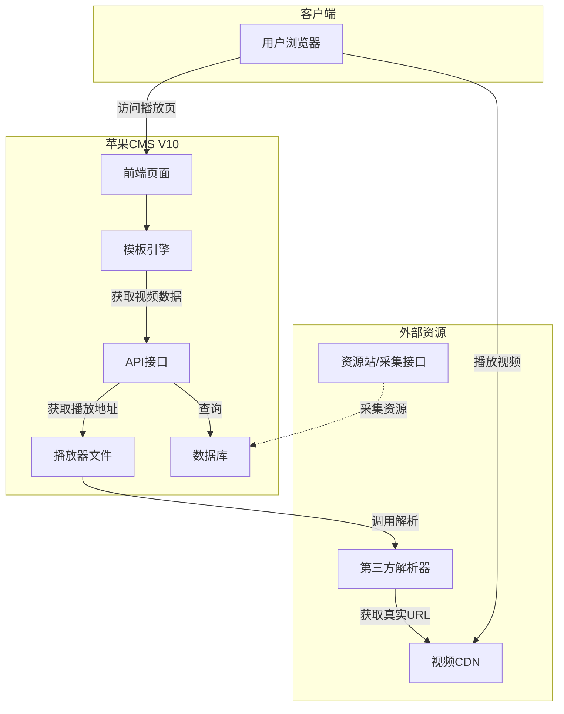
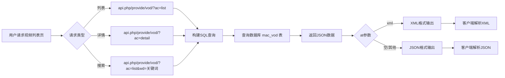
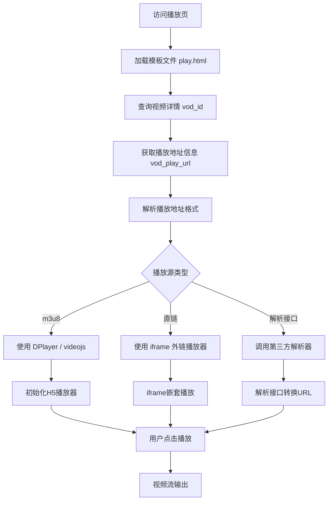
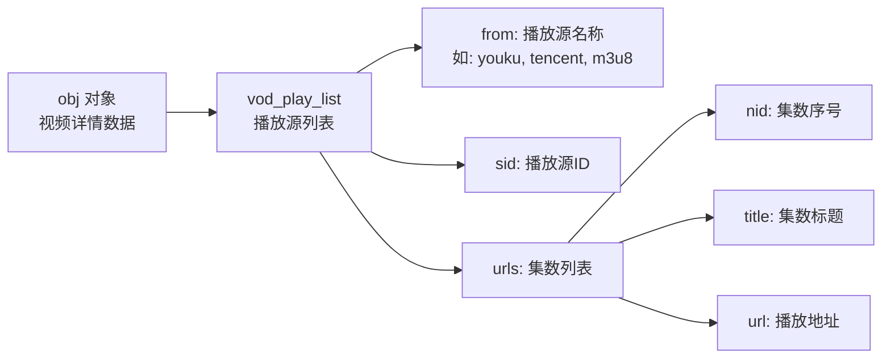
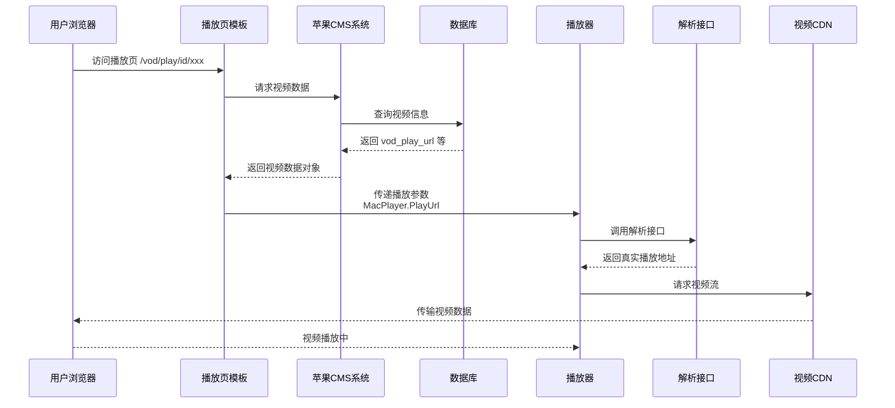
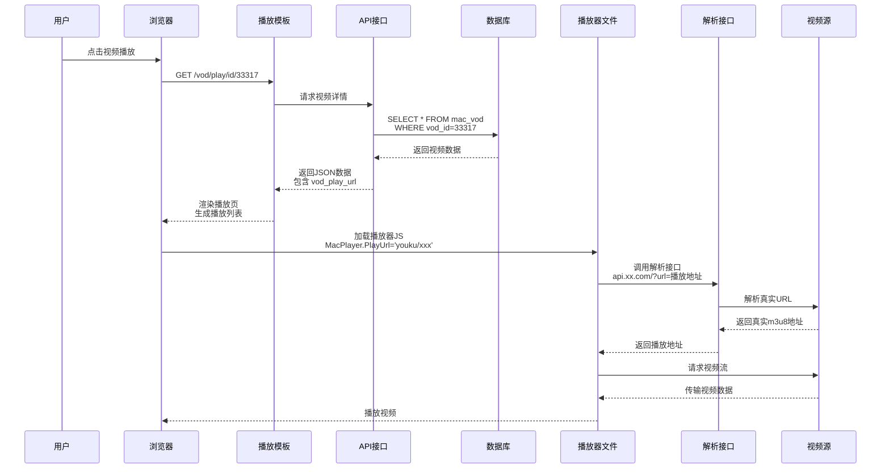
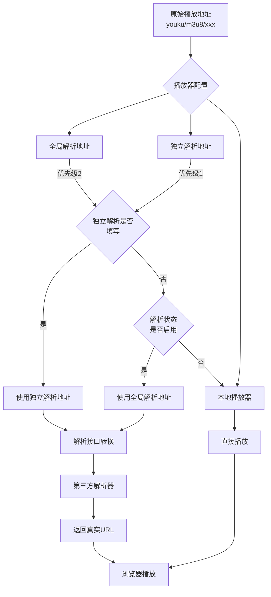
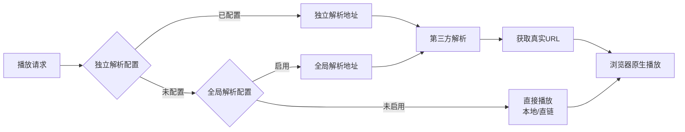
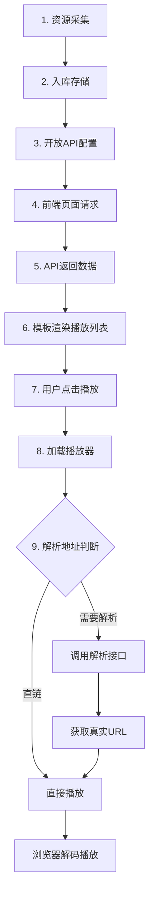

# 苹果 CMS V10 视频播放完整流程

## 目录

- [苹果 CMS V10 视频播放完整流程](#苹果-cms-v10-视频播放完整流程)
  - [目录](#目录)
  - [1. 整体架构流程](#1-整体架构流程)
  - [2. 数据获取流程](#2-数据获取流程)
    - [API 调用示例](#api-调用示例)
  - [3. 播放器渲染流程](#3-播放器渲染流程)
    - [播放页模板数据流转](#播放页模板数据流转)
  - [4. 视频播放流程](#4-视频播放流程)
  - [5. 完整时序图](#5-完整时序图)
  - [6. 播放地址解析流程](#6-播放地址解析流程)
    - [解析地址优先级](#解析地址优先级)
    - [播放器文件位置](#播放器文件位置)
    - [播放器配置流程](#播放器配置流程)
  - [7. 播放页模板标签](#7-播放页模板标签)
    - [模板标签说明](#模板标签说明)
  - [8. 播放器配置后台路径](#8-播放器配置后台路径)
  - [9. 流程总结](#9-流程总结)

---

## 1. 整体架构流程



---

## 2. 数据获取流程



### API 调用示例

```bash
# 视频列表
GET /api.php/provide/vod/?ac=list

# 视频详情
GET /api.php/provide/vod/?ac=detail&ids=33317

# 带分页
GET /api.php/provide/vod/?ac=list&pg=1&limit=20

# 搜索
GET /api.php/provide/vod/?ac=list&wd=战狼

# 指定分类
GET /api.php/provide/vod/?ac=list&t=6
```

---

## 3. 播放器渲染流程



### 播放页模板数据流转



---

## 4. 视频播放流程



---

## 5. 完整时序图



---

## 6. 播放地址解析流程



### 解析地址优先级



### 播放器文件位置

```
/static/player/           # 播放器目录
├── dplayer.html         # DPlayer播放器
├── videojs.html         # videojs播放器
├── ckplayer.html        # ckplayer播放器
└── player.js            # 播放器核心JS
```

### 播放器配置流程


---

## 7. 播放页模板标签

```html
<!-- 遍历所有播放源 -->
{maccms:foreach name="obj.vod_play_list" id="vo"}
<div class="play_source">
  <h2>{$vo.from}-在线播放</h2>
  <span>{$vo.player_info.tip}</span>
</div>

<!-- 遍历当前播放源的集数 -->
{maccms:foreach name="vo.urls" id="vo2"}
<a href="{:mac_url_vod_play($obj,['sid'=>$vo.sid,'nid'=>$vo2.nid])}"> {$vo2.title} </a>
{/maccms:foreach} {/maccms:foreach}
```

### 模板标签说明

| 标签                 | 说明                           |
| -------------------- | ------------------------------ |
| `obj.vod_play_list`  | 播放源列表数组                 |
| `vo.from`            | 播放源名称（youku, tencent等） |
| `vo.sid`             | 播放源ID                       |
| `vo.urls`            | 该播放源的集数列表             |
| `vo2.nid`            | 集数序号                       |
| `vo2.title`          | 集数标题                       |
| `vo2.url`            | 集数播放地址                   |
| `mac_url_vod_play()` | 生成播放页URL函数              |

---

## 8. 播放器配置后台路径

```
系统 → 播放器参数配置     # 全局解析地址
视频 → 播放器管理         # 单个播放器配置
  ├── 状态: 启用/禁用
  ├── 编码: dplayer
  ├── 名称: DPlayer播放器
  ├── 解析状态: 启用/禁用
  ├── 解析地址: http://xxx.com/?url=
  └── 播放器代码: 自定义嵌入代码
```

---

## 9. 流程总结



| 步骤        | 说明                                    |
| ----------- | --------------------------------------- |
| 1. 资源采集 | 从资源站采集视频信息到数据库            |
| 2. 入库存储 | 存储 vod_name, vod_play_url 等          |
| 3. API配置  | 后台开放API接口并配置参数               |
| 4. 页面请求 | 前端通过 /api.php/provide/vod/ 获取数据 |
| 5. 返回数据 | JSON 格式返回视频列表/详情              |
| 6. 渲染列表 | 模板引擎渲染播放源和集数列表            |
| 7. 点击播放 | 用户选择集数并点击播放                  |
| 8. 加载播放 | 根据配置加载对应播放器                  |
| 9. 解析播放 | 调用解析接口或直接播放                  |
